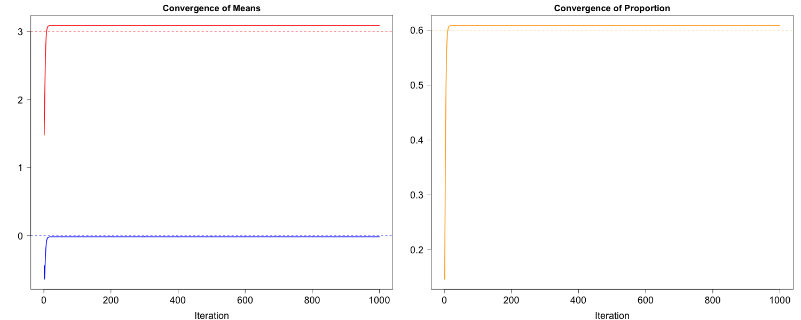

[](http://quantlet.de/)

## [](http://quantlet.de/) **EM_Algorithm** [](http://quantlet.de/)

```yaml


Name of Quantlet: EM_Algorithm
Published in: 'Non'
Description: 'Simulation example for Expectation Maximization use'
Keywords: 'simulation, R, Expectation Maximization, EM'
Author: 'Ruting Rainy WANG' 
Submitted:  '05.04.2024'
```

